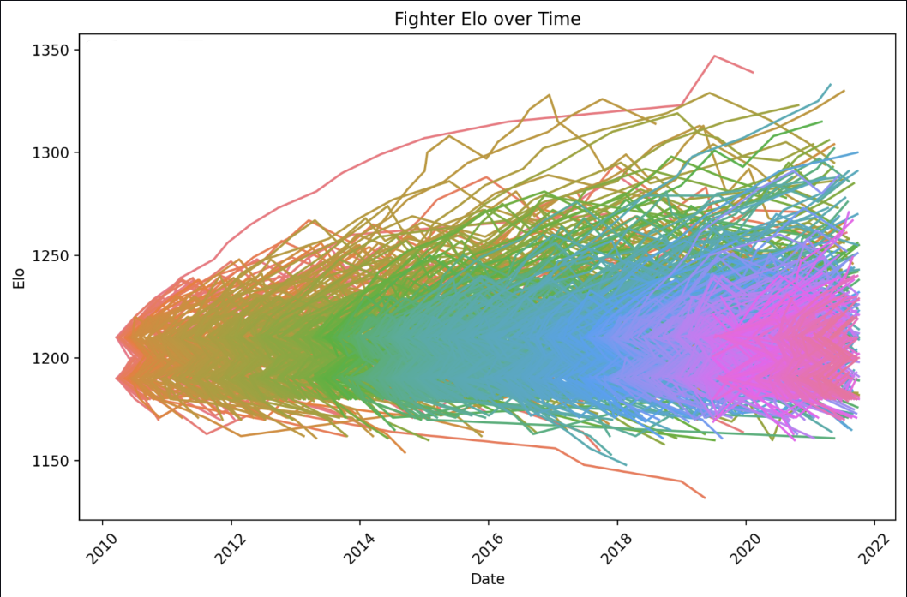
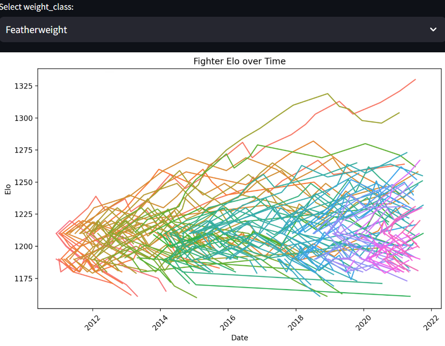
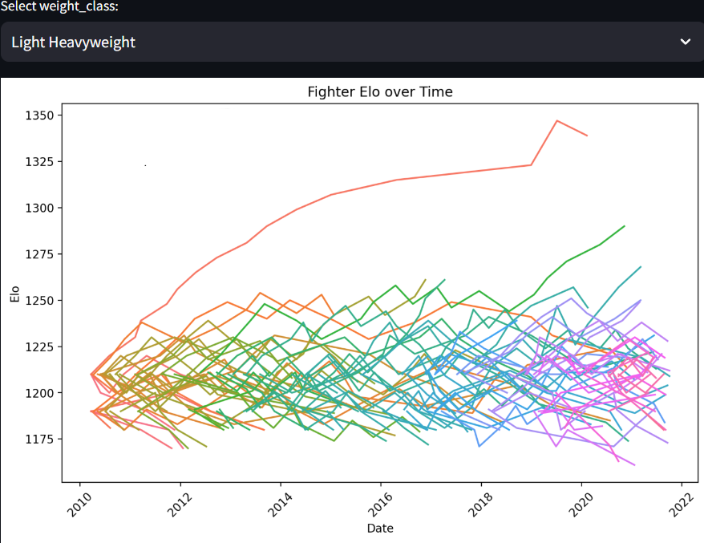
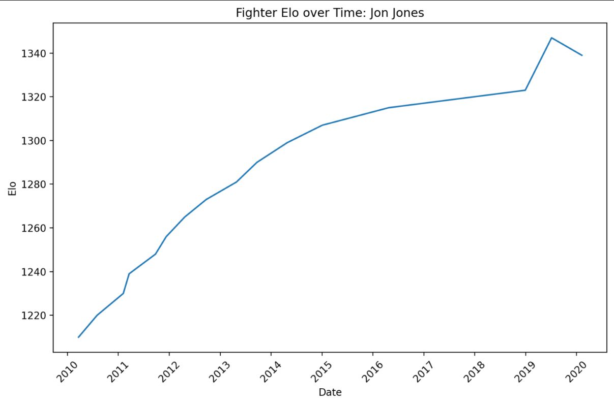
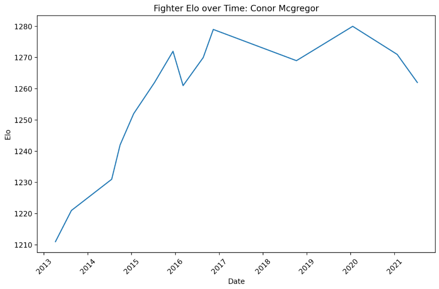

# UFC-ELO-Ranker-Python
Have you ever wondered who the greatest UFC fighter of all time is? Well now you can know the answer, via a custom ELO ranking system, similar to those found in chess or ranked video games.
Interact with this project on this website: https://ufc-elo-ranker.streamlit.app/

Here are some examples of the ELO ranking system's output:

All fighters ranked:

All featherweight fighters ranked:

All light heavyweight fighters ranked:

Jon Jones's individual ELO Ranking over time:

Conor McGregor's indivdual ELO ranking over time:

